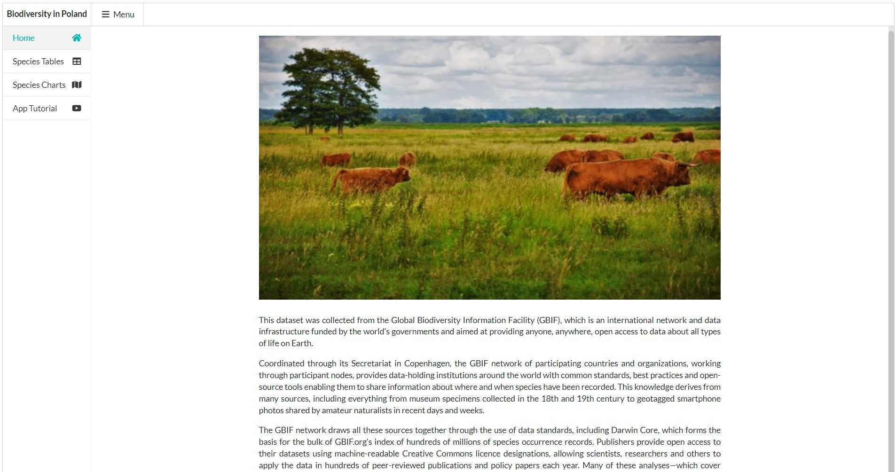

# Biodiversity_Shiny_App
Biodiversity of species occurrences in Poland. The R\Shiny demo app visualizes observed species on the map. The data comes from the Global Biodiversity Information Facility. The original dataset is extensive and covers the whole world, however, it uses only observations from Poland. the application offers a graphical representation of the data with maps and charts.

## Links
- Shinyapp: https://julio92-c.shinyapps.io/biodiversity_shiny_app/
- Source: https://github.com/Julio92-C/Biodiversity_Shiny_App

## R package requirements:
- shiny 1.7.2
- semantic.dashboard 0.2.1
- DT 0.23
- dplyr 1.0.9
- ggplot2 3.3.6
- leaflet 2.1.1
- plotly 4.10.0
- readr 2.1.2 
- scales 1.2.0
- testthat 3.1.4
- shinytest2 0.1.0
- renv 0.14.0

## Features:
- The application layout is made with semantic.dashboard, that semplifies the creation of dashboards.
- The home page gives an introduction of the dataset beeing used.
- The maps are realized with the leaflet package and plots are display with plotly package.
- Users are able to search for species by their vernacular name and scientific name.
- Besides, a timeline visualization is shown when selected species were observed.
- Final session showcases a tutorial with the features of the application.

# Authors
Julio Cesar - 2022, Beijing

The demo project designed to match Appsilon's test assignment.

# License
No licence
